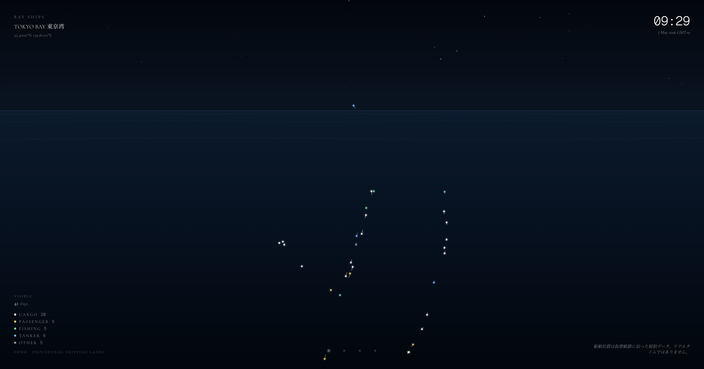
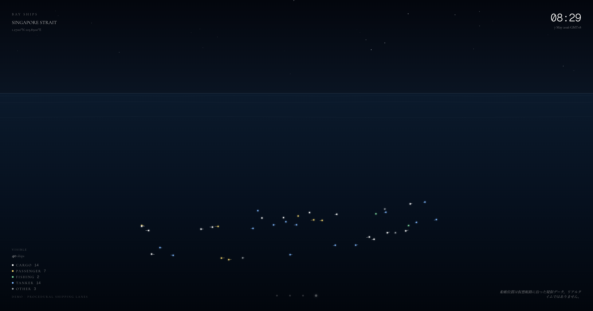
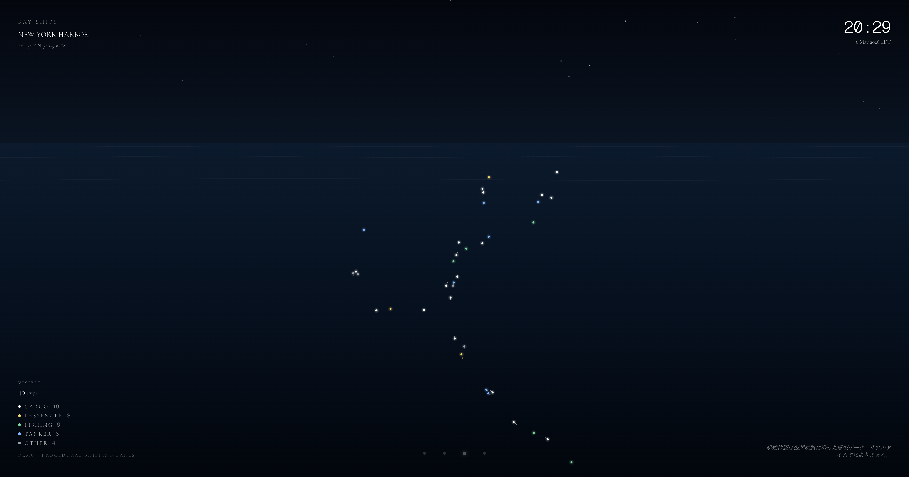

# Bay Ships

A real-time(-ish) ambient canvas of vessels moving through the world's busiest bays. Each dot is a ship, colored by type; the trail behind it is its path over the last 60 seconds.

<p align="center">
  
  
  
</p>

<p align="center"><em>Three of the world's busiest harbors at the same instant — Tokyo Bay (Uraga Channel) · Singapore Strait · New York Harbor (Verrazzano Narrows). White = cargo, yellow = passenger, green = fishing, blue = tanker, grey = other.</em></p>

**Live**: [bay-ships-2026-05-07.vercel.app](https://bay-ships-2026-05-07.vercel.app)

Open it as a tab, or set it as a Mac desktop wallpaper via [Plash](https://sindresorhus.com/plash) and watch the world's harbors breathe through the day.

Sister project to [Tide Pixels](https://github.com/Jada-Q/tide-pixels) — same Canvas/RAF backbone, different subject.

---

## Honest data label

> **v1 ships in `demo · procedural shipping lanes` mode.**
> Ship positions are generated client-side from hand-authored shipping-lane polylines per bay. The animation is **not** broadcasting live AIS signal. Dots, trails, type mix, and speeds are plausible but synthetic.

The real plan is to subscribe to [aisstream.io](https://aisstream.io)'s WebSocket feed and stream live AIS — that requires a (free) API key and a tiny server-side proxy to keep the key off the client. The data-mode plumbing already exists in `lib/ships.ts`; flipping `DATA_MODE` to `"live-ais"` and wiring `AIS_STREAM_KEY` to a Next.js route handler is the v2 task.

Either way, the UI never lies — the bottom-left and bottom-right labels always reflect the current mode (`demo · procedural`, `demo · snapshot`, or `live · aisstream.io`).

---

## Four bays

| Bay | URL |
|---|---|
| Tokyo Bay 東京湾 (default) | [`/`](https://bay-ships-2026-05-07.vercel.app/) |
| Osaka Bay 大阪湾 | [`/?b=osaka-bay`](https://bay-ships-2026-05-07.vercel.app/?b=osaka-bay) |
| New York Harbor | [`/?b=ny-harbor`](https://bay-ships-2026-05-07.vercel.app/?b=ny-harbor) |
| Singapore Strait | [`/?b=singapore`](https://bay-ships-2026-05-07.vercel.app/?b=singapore) |

The bottom dot row (right side on mobile) lets you switch between bays live.

---

## What you're actually looking at

- **Sky** — a 30%-tall band of deep navy with ~28 deterministic stars (seeded RNG, stable across reloads). Deliberately quieter than Tide Pixels — ships are the focus.
- **Sea** — flat gradient with three subtle wave bands and a horizon line. No tide simulation, no celestial bodies — that lives in Tide Pixels.
- **Ships** — ~40 per bay, distributed across hand-authored shipping lanes (Uraga Channel, Akashi Strait, Verrazzano Narrows, the Singapore TSS). Each one drifts forward along its lane at its assigned speed (cargo/tanker faster, fishing slower, passenger mid-high), reverses at the lane endpoint, and gets a small lateral wobble so the lane doesn't look like a string.
- **Trails** — every ship samples its position once per second. The last 60 seconds of samples are drawn as a fading line in the ship's type color.
- **Type colors** — `cargo: white`, `passenger: yellow`, `fishing: green`, `tanker: blue`, `other: gray`.

Position formula: small-area equirectangular projection centered on the bay (lat × 111.32 km/deg, lng × 111.32 × cos(lat)), scaled so the bay's `radiusKm` fits 90% of the shorter screen dimension.

---

## Tech stack

- Next.js 16 (App Router, server components for `searchParams`)
- Tailwind v4
- Cormorant Garamond + Geist Mono (`next/font/google`)
- Plain Canvas 2D + RAF — no animation library
- No backend (yet — see "Switching to live AIS" below)

---

## Local dev

```bash
pnpm install
pnpm dev
```

Open <http://localhost:3000>.

```bash
pnpm build  # production build
```

---

## Switching to live AIS (v2)

1. Sign up at <https://aisstream.io> (free) and copy the API key.
2. Add to `.env.local`:
   ```
   AIS_STREAM_KEY=<your key>
   ```
3. Add a Next.js Route Handler that opens `wss://stream.aisstream.io/v0/stream`, subscribes with `BoundingBoxes` for each bay, and re-broadcasts position reports to the client (Server-Sent Events or a WebSocket relay — the key never leaves the server).
4. In `lib/ships.ts`, set `DATA_MODE = "live-ais"` and replace `getShipsAt` with a function that reads from the SSE/WebSocket stream.
5. The UI labels in `Overlay.tsx` automatically flip to "live · aisstream.io".

---

## Used as a desktop wallpaper

1. Install [Plash](https://apps.apple.com/app/plash/id1494023538) (free, Mac App Store).
2. Plash menu bar → `Add Website…` → paste a bay URL above.
3. Keep `Browsing Mode` off — Bay Ships has no required interaction.

For multi-display: assign different bays per monitor (Tokyo on one, Singapore on another) — watching two harbors twelve timezones apart breathe at the same moment is the whole point.

---

## License

MIT — do whatever you want, but if you ship a paid product literally cloned from this, at least drop a thank-you somewhere.
